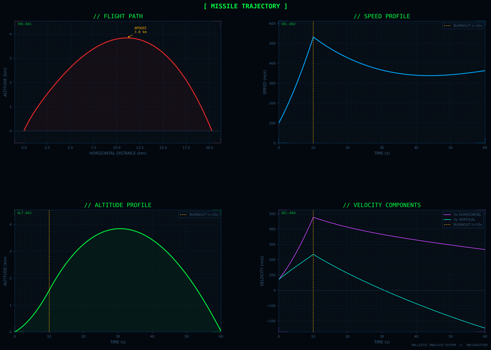
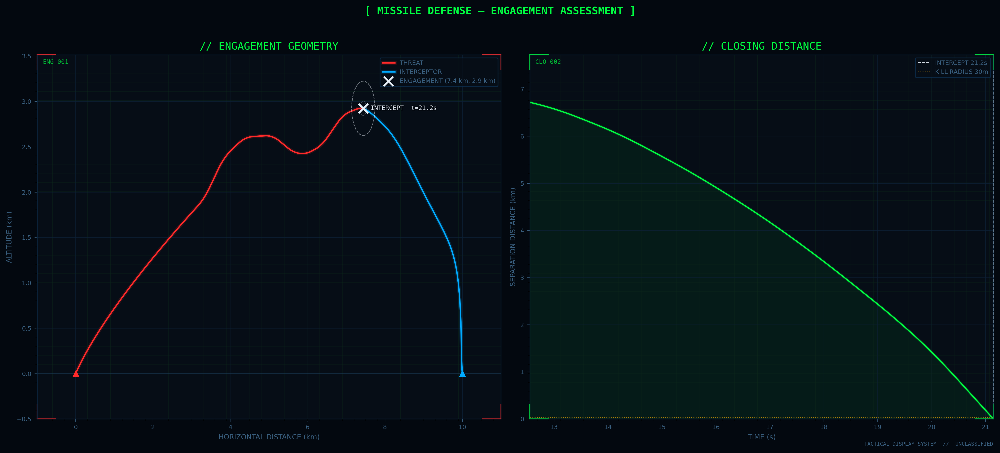

# Missile Intercept Simulation

> A physics-based, real-time missile defense simulation — built from scratch using only equations of motion, proportional navigation guidance, and Python.

---

## Demo

### Full Engagement Animation
https://github.com/CraftyCode121/Interceptor/blob/main/visuals/scenario_animation.mp4

> Missile launches, radar acquires the threat, interceptor fires after detection delay, and proportional navigation guides it to within 25m of an actively evading target.

---

## Sample Outputs

| Flight Trajectory Analysis | Intercept Scenario Overview |
|:--------------------------:|:---------------------------:|
|  |  |

---

## What This Is

This project simulates a complete missile defense engagement — from threat launch to intercept — using real physics and real guidance mathematics. No game engines. No simplified kinematics. Every object obeys thrust, drag, gravity, and mass depletion at every timestep.

The interceptor doesn't just "track" the missile. It uses **Proportional Navigation** — the same guidance law found in the AIM-9 Sidewinder, AMRAAM, and Patriot PAC-3 — to predict and close on the target even as it executes violent evasive maneuvers.

---

## How It Works

### The Physics
Both vehicles are simulated with full equations of motion — thrust vector, aerodynamic drag (quadratic with velocity), gravity, and continuously decreasing mass as fuel burns. Nothing is faked or interpolated.

### The Radar
The interceptor doesn't launch the moment the missile appears. It follows a realistic engagement sequence:
1. Missile enters radar detection range
2. Radar dwells on the track for 2 seconds to confirm
3. Crew reaction delay of 1.5 seconds
4. Interceptor launches

This produces a natural, realistic delay between threat and response — and makes the guidance problem significantly harder.

### Proportional Navigation
The interceptor's brain. At every timestep it measures how fast the **line-of-sight** to the target is rotating. If the LOS isn't rotating, it's already on a collision course — no correction needed. The moment the missile maneuvers and the LOS starts to drift, the interceptor fires a corrective acceleration proportional to that drift rate. Simple, efficient, devastatingly effective.

### Evasive Maneuvering
Post-burnout, the missile executes random lateral thrust kicks — always perpendicular to its velocity to maximize angular displacement seen by the interceptor. Directions alternate every kick to guarantee a visible zig-zag rather than drift in one direction. At 60,000N of lateral thrust on a 300kg airframe, each kick applies ~200 m/s² of sideways acceleration. The interceptor has to respond within milliseconds or start accumulating miss distance.

---

## Engagement Timeline

```
t =  0.0s   Missile launches from origin
t =  9.0s   Radar acquires threat at 8.0 km range
t = 11.0s   Track confirmed after 2.0s dwell
t = 12.6s   Interceptor LAUNCHES after 1.5s reaction
t = 21.9s   INTERCEPT — 25.6m miss distance ✓
```

---

## Results

| Metric | Value |
|--------|-------|
| Intercept time | t = 21.9s |
| Intercept altitude | 3.45 km |
| Intercept range | 7.72 km downrange |
| Miss distance | 25.6 m |
| Kill radius | 30 m |
| Evasive maneuvers | ~8 lateral kicks |
| Interceptor flight time | 9.3 seconds |

---

## File Structure

```
.
├── missile.py          # Missile: mass, thrust, drag, launch params
├── interceptor.py      # Interceptor: same physics, defense position
├── simulator.py        # Single-vehicle flight simulation
├── scenario.py         # Full engagement: radar, guidance, evasion, intercept
├── visualize.py        # Static plots + animated MP4
├── main.py             # Entry point
└── visuals/
    ├── trajectory.png
    ├── scenario.png
    └── scenario_animation.mp4
```

---

## Running

```bash
pip install numpy scipy pandas matplotlib

# Full animated scenario → saves scenario_animation.mp4
python main.py

# Scenario only (no animation)
python scenario.py

# Single missile trajectory analysis
python simulator.py
```

> **Note:** MP4 export requires `ffmpeg` — `brew install ffmpeg` / `sudo apt install ffmpeg`

---

## Tuning

All parameters are constants at the top of `scenario.py` — nothing buried:

```python
N                     = 5        # Navigation constant (higher = more aggressive interceptor)
RADAR_DETECTION_RANGE = 8000     # metres
RADAR_TRACK_TIME      = 2.0      # seconds to confirm track
REACTION_TIME         = 1.5      # seconds crew reaction delay
EVASION_THRUST        = 60000    # Newtons — crank this up to stress-test the guidance
EVASION_INTERVAL_MIN  = 0.5      # seconds between maneuvers
EVASION_INTERVAL_MAX  = 1.5      # seconds between maneuvers
EVASION_SEED          = 42       # set to None for different pattern every run
```

Drop `N` to 3 and watch the interceptor fail. Set `EVASION_SEED = None` for a different engagement every run.

---

## Dependencies

| Package | Purpose |
|---------|---------|
| `numpy` | Vector math |
| `scipy` | ODE solver for trajectory analysis |
| `pandas` | Trajectory data |
| `matplotlib` | Visualization and animation |
| `ffmpeg` | MP4 encoding |

---

## What's Next (maybe late)

- **3D simulation** — lateral evasion in the third dimension 
- **Salvo engagement** — multiple interceptors, probability of kill modeling  
- **Radar noise** — inject measurement error into the guidance loop
- **Monte Carlo** — run 1000 scenarios, plot miss distance distribution
- **Augmented PN** — factor in estimated target acceleration for tighter intercepts

---

*Built from scratch — no game engines, no shortcuts, just physics and math.*
